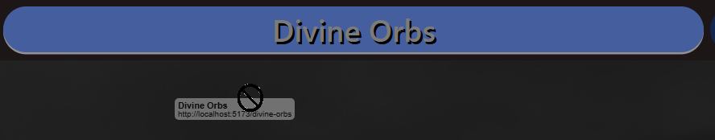

# Improvement Plan

## Section 1 - Must Have

1. Create Logo
    - Add to header
    - Clicking logo takes you to home

## Section 2 - Fixes
### Header
2. **(MAY BE FIXED)** When zooming-in, make buttons grow equally in both directions or wherever there's space. Currently gives full prio to whatever is leftmost

3. Fix background image only darkening the top portion

4. Bring body text farther from the border

5. When zoomed in on "About", you get a horizontal scrollbar the size of a vertical scrollbar. Needs a fix

6. After updating h1 links to simply using the link w/ classname, the unclick animation stopping working

7. After updating h1 links to simply using the link w/ classname, vertical button size changed. Check margins, etc and make sure they still work, but simply have new defaults since using new html types. Maybe make buttons thinner

8. Update buttons so that click and drag before release (Related to fix for the unclick animation) doesn't drag a link behind:

9. Create state for buttons so that the highlighted one stays highlighted when it has been activated and then you click somewhere else

10. Speed up the animation for click / unclick (right now, all animation times are the same with highlight and click)

## Section 3 - Nice to Have

1. Day Mode / Night Mode
    - Watch for contrast, maybe check metadata or just day/night mode to update cursor color and other color themes

2. Add footer with privacy policy, contact-us, etc. Check what other people use for examples
    - Create those pages

## Section 4 - General Guidelines
1. Add titles for blocks of text, images, graphs, etc

2. No Horizontal Scrollbars

## Section 5 - Completed
1. Make entire header button redirect (not just text)